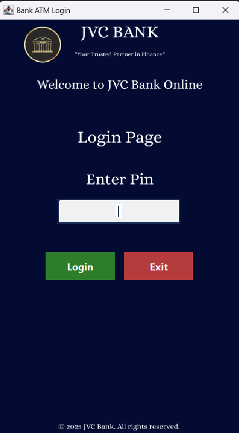
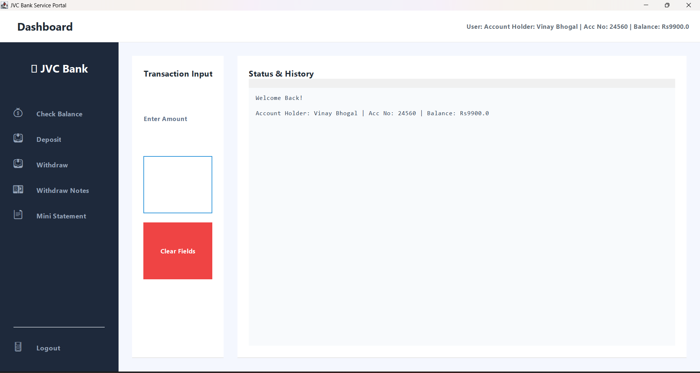

# ATM Simulation System

## 📌 Overview
The **ATM Simulation System** is a Java mini-project built in **IntelliJ IDEA** that simulates ATM functionalities using a **SQL database**.  
It provides a **Login Page** and a **Main Page** with options to:  
- ✅ Check Balance  
- 💰 Deposit Money  
- 💸 Withdraw Money  
- 📜 View Last 5 Transactions  
- 🚪 Exit  

---

## ⚙️ Features
- Secure login with database validation.  
- Check balance anytime.  
- Deposit money with automatic balance update.  
- Withdraw money with sufficient balance check.  
- View last 5 transactions (mini statement).  
- SQL database integration with **JDBC**.  

---

## 📸 Screenshots

  
  
  

  <b>Login</b> &nbsp;&nbsp;&nbsp;
  <b>Dashboard</b> &nbsp;&nbsp;&nbsp;
  

---

## 🏗️ Technologies Used
- Java (JDK 8 or above)  
- IntelliJ IDEA (IDE)  
- JDBC (Java Database Connectivity)  
- MySQL / SQL Database  

---

## 🗄️ SQL Table Schemas

-- Account Table
CREATE TABLE account (
acc_no INT PRIMARY KEY,
name VARCHAR(50) NOT NULL,
pin INT NOT NULL,
balance DOUBLE
);

-- Login Table
CREATE TABLE login (
pin INT PRIMARY KEY,
password INT
);

-- Transactions Table
CREATE TABLE transactions (
id INT PRIMARY KEY AUTO_INCREMENT,
acc_no INT,
type VARCHAR(20),
amount DOUBLE,
date TIMESTAMP DEFAULT CURRENT_TIMESTAMP
);

-- Notes Inventory Table
CREATE TABLE notes_inventory (
id INT PRIMARY KEY AUTO_INCREMENT,
note_500 INT DEFAULT 100,
note_200 INT DEFAULT 100,
note_100 INT DEFAULT 100,
note_50 INT DEFAULT 100,
note_20 INT DEFAULT 100,
note_10 INT DEFAULT 100,
last_updated TIMESTAMP DEFAULT CURRENT_TIMESTAMP ON UPDATE CURRENT_TIMESTAMP
);

text

---

## 🔍 Example SQL Queries

-- Insert a new account
INSERT INTO account (acc_no, name, pin, balance) VALUES (1, 'John Doe', 1234, 5000.00);

-- Deposit Money (Update balance)
UPDATE account SET balance = balance + 1000 WHERE acc_no = 1;

-- Withdraw Money (with check)
UPDATE account SET balance = balance - 500 WHERE acc_no = 1 AND balance >= 500;

-- Fetch Last 5 Transactions (Mini Statement)
SELECT * FROM transactions WHERE acc_no = 1 ORDER BY date DESC LIMIT 5;

-- Check Notes Inventory
SELECT * FROM notes_inventory ORDER BY last_updated DESC LIMIT 1;

text

---

## 🚀 Getting Started

1. **Clone this repository**  
2. **Setup the Database**  
   - Import the table creation SQL scripts above in your MySQL database.
3. **Configure Database Credentials in Java**  
   - Update the database URL, username, and password in your Java code.
4. **Run the Project in IntelliJ IDEA**  
   - Build and execute the application to launch the ATM Simulation System.

---
